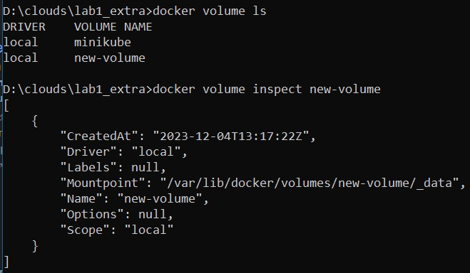
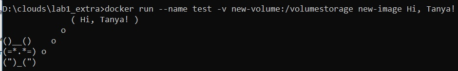
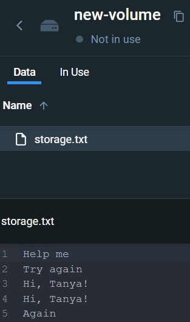

# Отчет по части со звездочкой

__Что нужно сделать:__
1. Приложение в контейнере записывает изменения в базу данных
2. То, что нужно записать, передается в команде запуска контейнера
3. После остановки контейнера записанная информация сохраняется
4. Dockerfile должен быть с именем, отличным от Dockerfile

Вспомним о том, что Docker-контейнеры являются "одноразовыми", эфемерными. Мы должны иметь возможность в любой момент их остановить/удалить, не переживая о том, что внутри контейнера лежат какие-то файлы государственной (или не очень) важности. Как в таком случае реализовать запись данных в базу с помощью приложения, запущенного в контейнере? Для этих целей нам потребуется разобраться с тем, что такое bind mount и Docker Volumes.

## 1. Bind mount

Технология bind mount - один из способов организации постоянного хранения данных, подлежащих сохранению после остановки контейнера. При таком подходе мы в Docker-контейнер монтируем реальную папку(или любую другую область памяти) из хостовой файловой системы. Способ простой и понятный, однако не лишенный недостатков: пользоваться такой папкой сможет не только сам контейнер, но и процессы, находящиеся за пределами Docker, что черевато неприятными последствиями. 
Этот способ может быть хорош при разработке - для тестирования в онлайн режиме и т. п., однако он не слишком хорошо подходит под наши цели и в целом не рекомендуется как решение для продакшена. 

## 2. Docker Volumes (Тома Docker)

Тома - еще один из способов сохранить данные, генерируемые в процессе жизни контейнера. Docker-контейнер видит том как обычный каталог, который мы определяем в Dockerfile. Сам том при этом хранится в специально выделенной под Docker области памяти файловой системы хостовой машины (но при желании тома можно хранить на удаленных серверах или в облаке).

Тома Docker позволяют организовать совместное использование данных несколькими контейнерами, непосредственно удаленное хранение данных и некоторые другие полезные штуки, вроде бэкапов и миграции данных на другой хост с Docker.

Организуем сохранение данных из нашего контейнера в том Docker:

1. Создадим новый том *docker volume create new-volume*

2. Запустим контейнер, который будет присоединять внутренний каталог к тому созданному тому: *docker run --name test -v new-volume:/volumestorage test-image Hi, Tanya!*

3. Запись в файл производится в приложении Python, лежащем в контейнере. Файл открывается в режиме дозаписи, так что каждый новый контейнер должен добавлять новую строчку в этот файл. Проверим, что данные действительно сохраняются при остановке контейнера: 

## 3. не-Dockerfile

В целом, мы можем именовать Dockerfile как нам угодно - это не повлияет ни на что, кроме синтаксиса команды при построении образа и возможности использовать автосборщик (autobuilder). Если мы собираемся использовать автосборщик, Dockerfile всегда должен быть Dockerfile'ом.

Что касается синтаксиса команды. Когда мы используем традиционное название докерфайла, нам достаточно написать:

*docker build -t <tag_name> .*

Если же мы поменяли имя докерфайла, необходимо явно на него указать с помощью опции -f(--file):

*docker bouild -f <new.Dockerfile> -t <tag_name> .*

Насчет именования докерфайла есть несколько различных мнений - кто-то считает, что имена должны иметь вид Dockerfile.<purpose>, кто-то наоборот - <purpose>.Dockerfile, что-то вообще от Dockerfile оставляет только D в качестве "расширения". Тут все остается на усмотрение разработчика.