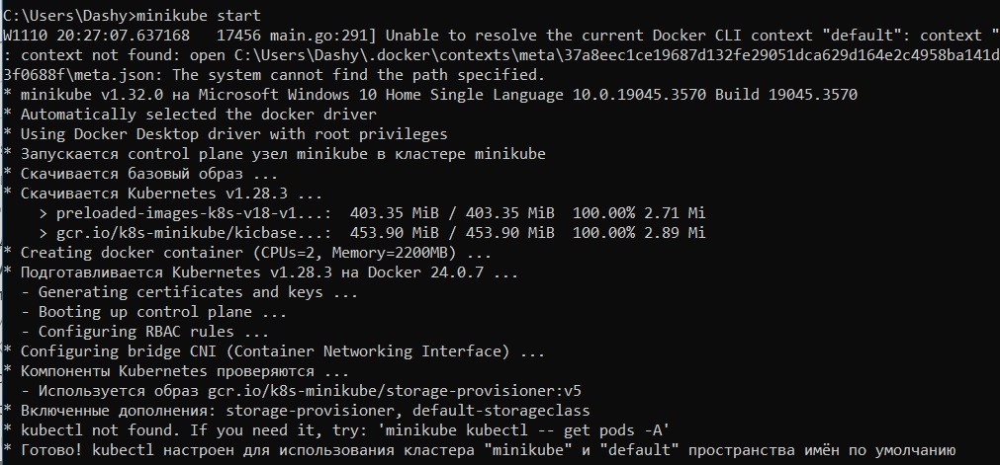

# Отчет по второй лабораторной работе
## 1. Что нужно сделать

1. Локально поднять kubernetes кластер
2. Развернуть в кластере свой сервис, используя 2-3 ресурса kubernetes
3. Продемонстрировать работоспособность сервиса
4. Прочитать книжку с жирафом

## 2. Что такое Kubernetes

Kubernetes - это система оркестрации, программная платформа для автоматического управления контейнеризированными приложениями в условиях кластера - их развертывания, репликации, масштабирования и мониторинга. Кубер дает нам необходимые инструменты для гибкой работы распределенных систем. 

Что он может:
1. Мониторить сервисы и балансировать нагрузку
2. Наиболее эффективно распределять ресурсы узлов
3. Автоматически создавать или удалять контейнеры
4. Автоматически монтировать хранилище и управлять им
5. Контролировать работу контейнеров - перезапускать отказавшие, отключать и заменять не прошедшие проверку работоспособности
6. Хранить конфиденциальную информацию и управлять ей

Кластер Kubernetes состоит из различных объектов:
- Ноды (узлы, nodes) - физические или виртуальные машины, на которых развертываются и запускаются контейнеры с приложениями. Могут быть двух типов - Master (узел, управляющий всем кластером) и Worker (узлы, на которых работают контейнеры)
- Поды - абстрактные объекты, обертки для одного или нескольких контейнеров
- Контроллеры - средства управления, следящие за кластером и поддерживающие его в необходимом состоянии (Deployment, ReplicaSet, StatefulSet, DaemonSet, Job)
- Сервисы - объединяют поды в логические группы и определяют политику доступа к ним
- Постоянные тома
- Пространства имен

## 3. Поднятие кластера

Для начала убедимся, что у нас есть все необходимые компоненты для работы с Kubernetes:
- Docker Desktop был поставлен ранее, в нем мы разрешили работу с Kubernetes.
- Для управления кластером нам необходима компонента Kubectl
- Для создания кластера нам нужна программа Minicube - пожалеем наш компьютер и не будем замахиваться на что-то более амбициозное и большое.

После того, как мы установили все необходимые компоненты, можем поднимать собственный кластер:



Поскольку мы только знакомимся с контейнеризацие в целом и Kubernetes в частности, в качестве сервиса возьмем образ hello-world с Docker Hub. Кластер мы уже подняли, можно создавать deployment:

*kubectl create deployment test-deployment --image hello-world*

Командой *minicube dashboard* откроем панель kubernetes:


Конкретно на этом этапе моему компьютеру стало плохо из-за того, что у него не хватает ресурсов на развертывание деплоймента. Это стало понятно из статуса пода - CrashLoopBackOff. 
Зато теперь мы на практике узнали, что Deployment - это контроллер, который управляет состоянием развертывания подов, следит за удалением и созданием экземпляров подов (100500 попыток развернуть под и ни одной удачной). По совместительству, он управляет контроллерами ReplicaSet, так что использовать отдельно ReplicaSet мы не могли. Также, не было смысла испльзовать для развертывания ресурсы StatefulSet или DaemonSet - наше приложение не сохраняет состояние и у нас всего один узел, так что нам не нужно отслеживать наличие копий пода на каждом из нескольких узлов.

Сейчас наш сервис не доступен из публичного интернета, Получить доступ к нему можно только по внутреннему IP-адресу внутри кластера Kubernetes. Чтобы это исправить, представим под с этим контейнером как сервис Kubernetes. Для этого выполним команду *kubectl expose deployment test-deployment --type=LoadBalancer --port=8080*

Для проброса трафика также можно было бы использовать Ingress, но конкретно для нашей задачи этот способ избыточен - у нас одна нода, на которой один под, здесь незачем настраивать точку вхождения в кластер и маршрутизацию.

## 4. Описание с помощью yaml-файла
Прописывать все команды ручками - это, конечно, интересно, но совершенно непродуктивно, а также непрозрачно. Для того, чтобы исправить ситуацию, опишем наш деплоймент с помощью yaml-файла.  

YAML - это язык, спроектированный для хранения информации в доступном для понимания человеком формате. Написание конфигурационных файлов в таком формате помогает реализовать подход "Инфраструктура как код".

Файл для развертывания нашего приложения будет иметь следующий вид:
```
apiVersion: v1
kind: Deployment
metadata:
    name: test-deployment
spec:
    replicas: 1
    template:
        metadata:
          labels:
            app: hello-app
        spec:
          containers:
            - image: hello-world
              name: hello-world
              ports:
                - containerPort: 80
```
Код для описания сервиса LoadBalancer:
```
apiVersion: v1
kind: Service
metadata:
    name: test-deployment-lb
spec:
    type: LoadBalancer
    ports:
        port: 80
        protocol: TCP
        targetPort: 80
```