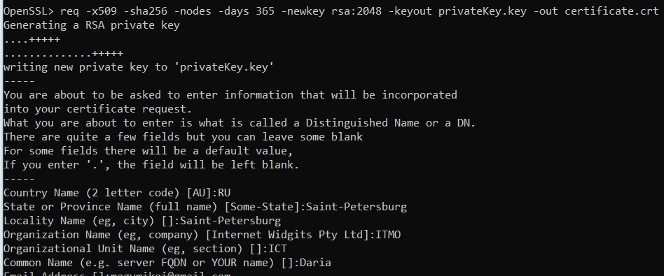
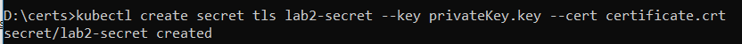
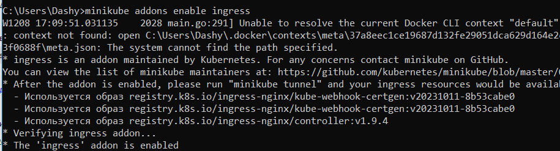
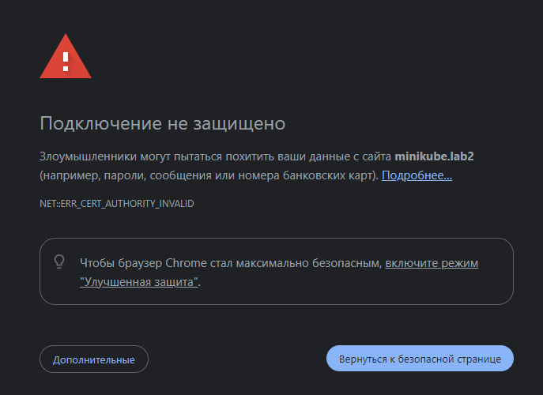
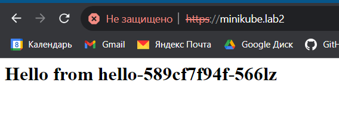
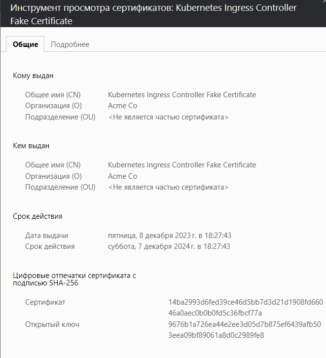

# Отчет по второй лабораторной работе (часть со звездочкой)
## 1. Что нужно сделать

1. Настроить подключение к сервису в миникубе через https
2. Использовать самоподписанный сертификат
3. Приложить скриншот с информацией о сертификате из браузера
4. Объяснить, почему браузер ругается на сайт

## 2. Сертификаты безопасности

Цифровой сертификат безопасности (SSL) - это сертификат безопасности, необходимый для безопасной передачи данных с помощью протокола шифрования. Использование этого протокола гарантирует безопасность обмена данными между сервером web-портала и браузером пользователя. Другими словами, SSL-сертификат защищает пользователей от хищения или подмены данных.

Как работают подобные сертификаты:
- Пользователь пытается перейти на интернет-ресурс
- Браузер определяет, по какому IP-адресу нужно пойти (DNS)
- Переходит на веб-сервер хоста и запрашивает у него безопасное SSL-соединение
- Хост возвращает данные о сертификате
- Браузер проверяет валидность полученных данных и, если все хорошо, устанавливает защищенное соединение

Различают 6 типов SSL-сертификатов, разница между которыми в стоимости и в уровне проверки: сертификаты с расширенной проверкой; сертификаты, подтверждающие организацию; сертификаты, подтверждающие домен; wildcard-сертификаты; мультидоменные сертификаты и сертификаты унифицированных коммуникаций.

Есть три способа получить SSL-сертификат - приобрести у компании, сделать самому или получить бесплатно.

### 2.1 Самоподписанные (самозаверенные) сертификаты

Самоподписанный сертификат — это сертификат, не подписанный центром сертификации. Такой сертификат генерируют на хостинговом сервере, где расположен сайт. Самоподписанные сертификаты бесплатны. 

Технически, такие сертификаты мало чем отличаются от обычных SSL-сертификатов: позволяют шифровать учетные данные и конфиденциальную информацию пользователей. Однако, поскольку такие сертификаты выпускают не сторонние и доверенные центры сертификации, они не соответствуют требованиям CA/Browser Forum и браузеры не доверяют им - на страницах с самоподписанным сертификатом пользователи видят предупреждения о небезопасности сайта.

### 2.2 Создание самоподписанного сертификата

Для создания самоподписанного сертификата воспользуемся возможностями утилиты openssl - сгенерируем сертификат и ключ к нему:



Флаг -x509 указывает, что сертификат является самоподписанным, флаг -newkey отвечает за автоматическую генерацию нового ключа, флаг -days говорит о том, что сертификат действует в течение 365 дней.

## 3. Настройка доступа к сервису

На основе сгенерированных ранее сертификата и ключа создадим секрет Kubernetes командой *kubectl create secret tls lab2_secret --key privateKey.key --cert certificate.crt*



Немного поменяем созданные ранее yaml файлы - теперь доступ к сервису будет выполняться не только через NodePort, но и через Ingress (предварительно его включаем командой *minikube addons enable ingress*):



```
apiVersion: networking.k8s.io/v1
kind: Ingress

metadata:
  name: new-ingress
  namespace: default

spec:
  ingressClassName: nginx
  tls:
  - hosts:
    - minikube.lab2
    secretName: lab2-secret
  rules:
  - host: "minikube.lab2"
    http:
      paths:
      - path: "/"
        pathType: Prefix
        backend:
          service:
            name: my-app-np
            port:
              number: 80
```

Внесем изменения в файл hosts - добавим строку соответствия предпочитаемому адресу сервиса IP-адресу 127.0.0.1 (потому что работа выполняется на Windows и возможности обращаться к системе по IP адресу миникуба просто нет. А если она и есть, то только через костыли на костылях. Судя по всему, адекватно Ingress будет работать только на Linux системах)

Проверим доступность сервиса по доменному имени:





Посмотрим, какцю информацию о сертификате отображает браузер:

