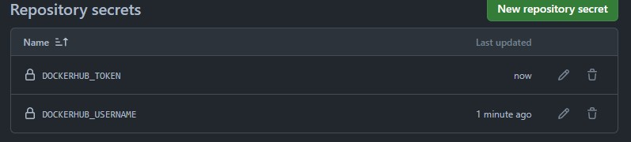
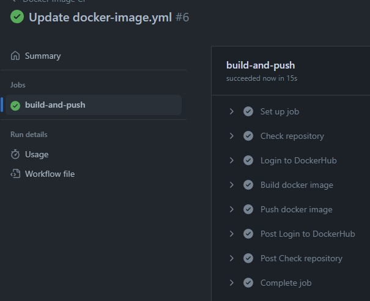
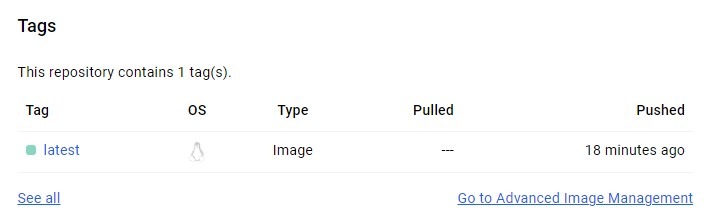

# Отчет по третьей лабораторной работе
## 1. Что нужно сделать

1. После пуша в репозиторий должен собираться докер образ
2. Результат сборки образа должен куда-то сохраняться

## 2. Github Actions

Создадим файл docker-image.yml по пути .github/workflows/docker-image.yml. В этом файле будут описаны задачи, которые будут выполняться автоматически при пуше в ветки dev и main и при pull request'ах в них же. Для дальнейшего удобства в качестве места хранения собранного образа выбран DockerHub.

```
name: Docker Image CI

on:
  push:
    branches: [ "main", "dev" ]
  pull_request:
    branches: [ "main", "dev" ]

jobs:

  build-and-push:

    runs-on: ubuntu-20.04

    steps:
    - name: Check repository
      uses: actions/checkout@v3

    - name: Login to DockerHub
      uses: docker/login-action@v2
      with:
        username: ${{ secrets.DOCKERHUB_USERNAME }}
        password: ${{ secrets.DOCKERHUB_TOKEN }}

    - name: Build docker image
      run: docker build . -f lab1_extra/new.Dockerfile -t megymikei/hello-app

    - name: Push docker image
      run: docker push megymikei/hello-app
```

В качестве версии убунту выбрана 20.04, т.к. на домашнем компьютере стоит именно она. При желании можно заменить на любую другую совместимую версию.

Для авторизации в DockerHub необходимо завести в программу логин и пароль к аккаунту. Чтобы не делать это в открытую, спрячем необходимые данные в секреты GitHub:



Проверка репозитория и авторизация в DockerHub выполняется с использованием шаблонов из официальных репозиториев GitHub Actions и Docker, push и pull шаги прописаны консольными командами разнообразия ради.

Сделаем пуш в main и посмотрим, как наше действие успешно отработает: 



Проверим, что образ на DockerHub действительно подгрузился: 

