# Отчет по третьей лабораторной работе (со звездочкой)
## 1. Что нужно сделать

1. Настроить работу с секретами (по красоте)

## 2. Настройка Hashicorp Vault

В качестве места для хранения секретов возьмем Hashicorp Vault. Воспользоваться веб-сайтом можно через VPN. 

Чтобы у нас все получилось, нужно проделать следующие действия:
1) Поднять на своем хосте Hashicorp Vault server
2) Создать необходимые секреты 
3) Поднять self-hosted runner там же, где и секретохранилку
4) Внести изменения в yaml файл для Github Actions
5) Проверить и отладить результат

Начнем с установки и настройки сервера секретохранилки:
Загружаем исполняемый файл Vault с официального сайта HashiCorp. Сервер запускаем в формате сервера разработки, такой вариант не подойдет для прода, но будет неплохим вариантом для знакомства с функционалом.

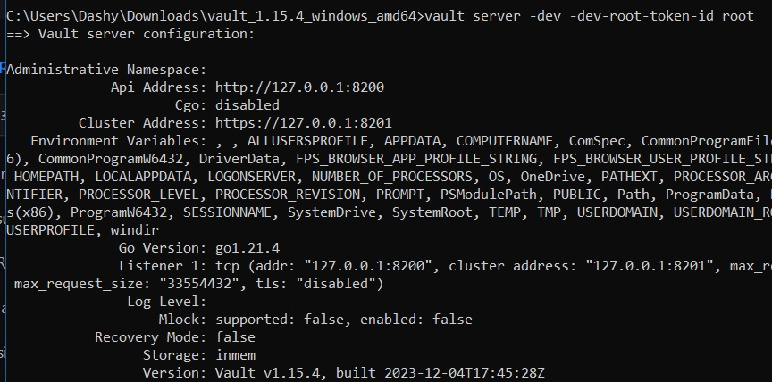

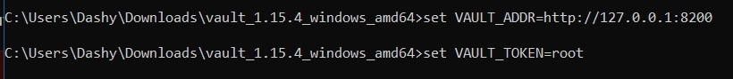

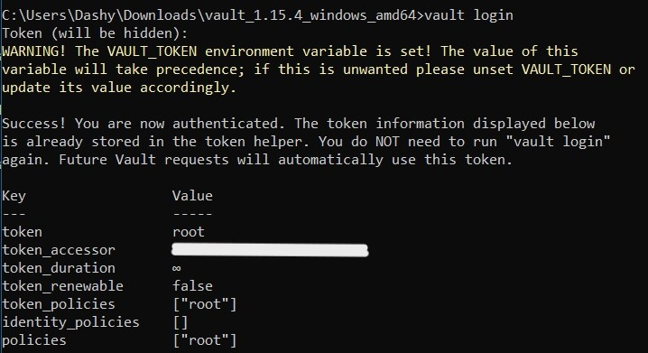

После того, как мы установили сервер и вошли в систему, мы можем создать необходимые секреты:

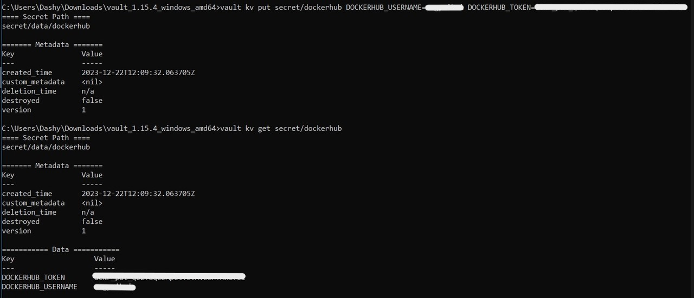

И настроить для них политики доступа (только на чтение):

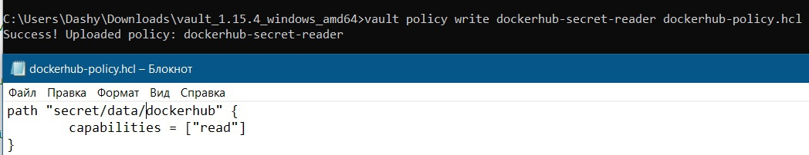

Теперь генерируем токен для входа в секретохранилку на основе созданной политики и забираем из него строку, лежащую в ".auth.client_token" - с этим токеном наш CI/CD будет заходить в Vault за секретами:

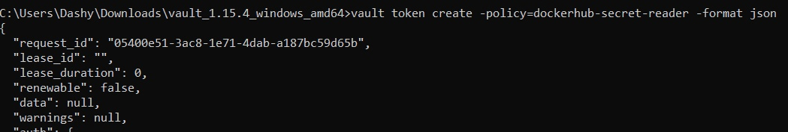

Проверим, что токен рабочий:

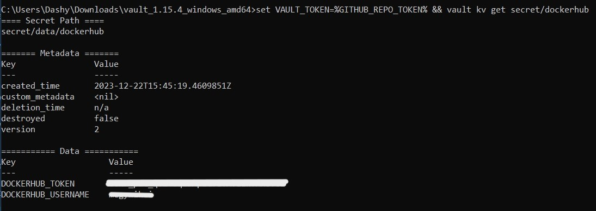

Отлично! Оставляем в секретах Github Actions только этот токен, все остальное там больше лежать не будет:

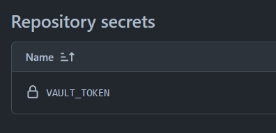

Настройку HashiCorp Vault можно считать завершенной, перейдем к настройке Github Actions. 

Нам нужно создать Self-Hosted Runner - создать окружение для него и установить последнюю версию раннера, проверить совпадение хэша и извлечь установщик:

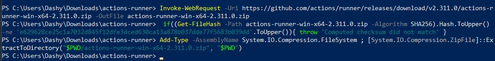

Также привязываем исполнитель к нашему репозиторию:

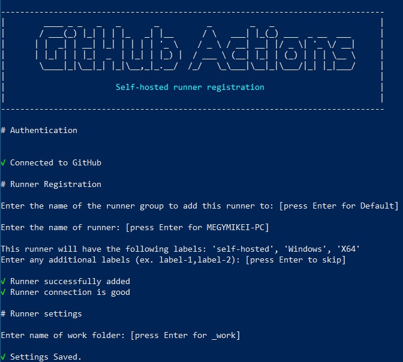

Нам осталось внести некоторые изменения в файл docker-image.yaml, созданный ранее, чтобы теперь секреты брались не из репозитория, а из секретохранилки:

```
name: Docker Image CI

on:
  push:
    branches: [ "main", "dev" ]
  pull_request:
    branches: [ "main", "dev" ]

jobs:

  build-and-push:

    runs-on: self-hosted

    steps:
    - name: Check repository
      uses: actions/checkout@v3

    - name: Import Secrets
      uses: hashicorp/vault-action@v2
      with:
        url: http://127.0.0.1:8200
        tlsSkipVerify: true
        token: ${{ secrets.VAULT_TOKEN }}
        secrets: |
          secret/data/dockerhub DOCKERHUB_USERNAME ;
          secret/data/dockerhub DOCKERHUB_TOKEN ;

    - name: Login to DockerHub
      uses: docker/login-action@v2
      with:
        username: ${{ env.DOCKERHUB_USERNAME }}
        password: ${{ env.DOCKERHUB_TOKEN }}

    - name: Build docker image
      run: docker build . -f lab1_extra/new.Dockerfile -t megymikei/hello-app

    - name: Push docker image
      run: docker push megymikei/hello-app
```

Сохраним изменения, сделаем пуш в ветку dev и проверим, что задача успешно выполнилась:

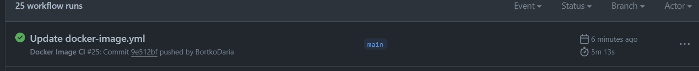

После исправления нескольких ошибок - успешно! Разбираться было интересно, но выполнять работу на Linux'e определенно было бы приятнее, чем на Windows. 