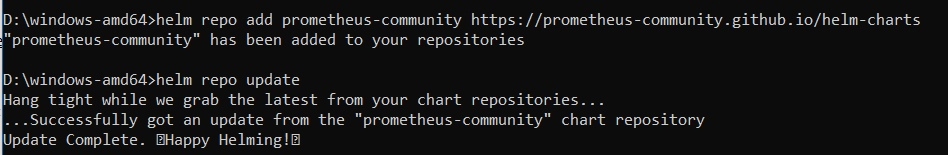
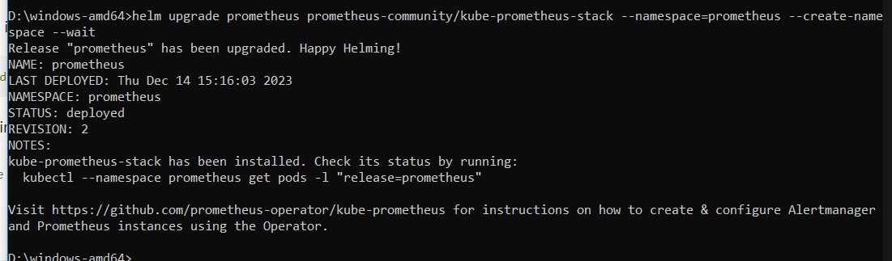
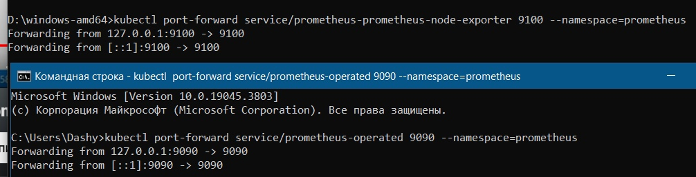
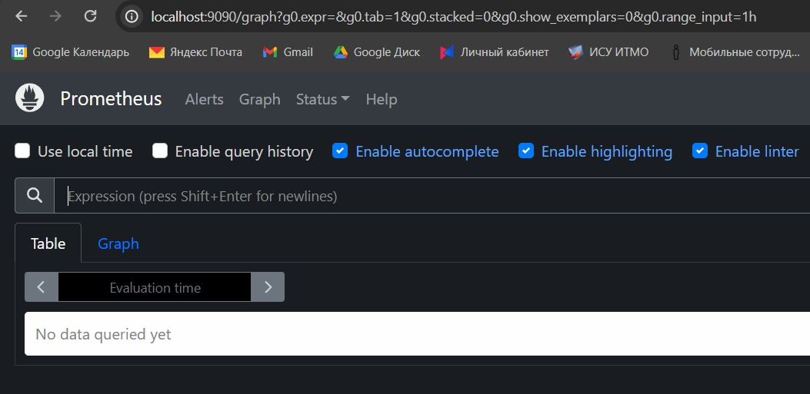
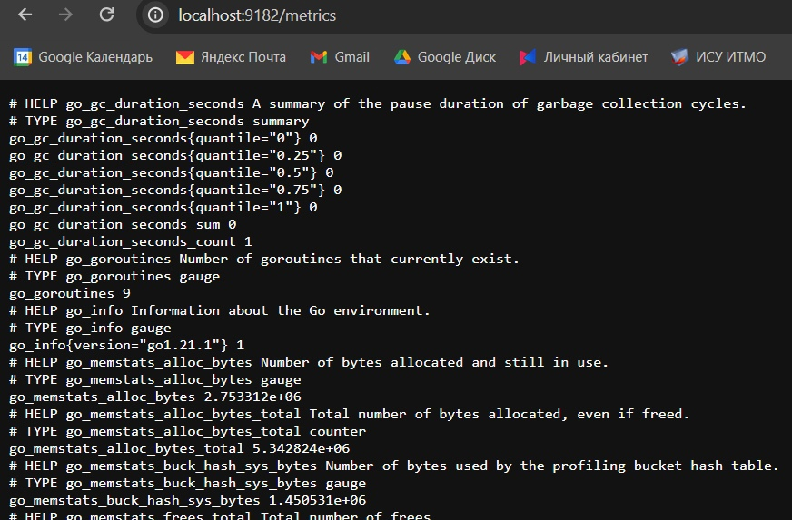
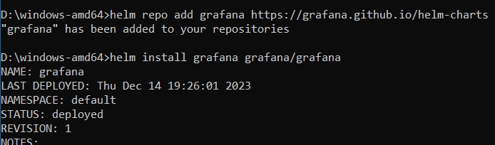
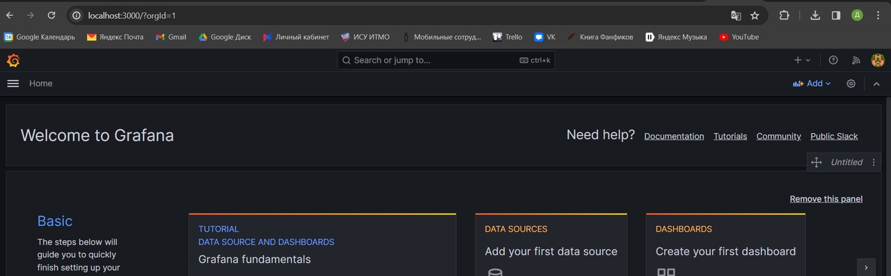
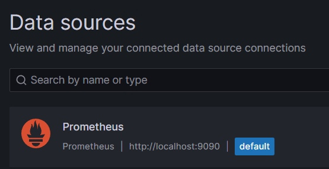
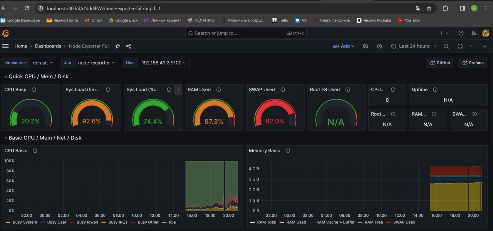

# Отчет по третьей лабораторной работе
## 1. Что нужно сделать

1. Настроить мониторинг сервиса с помощью Grafana и Prometheus

## 2. Настройка мониторинга

Grafana - инструмент визуализации и анализа данных, который используется для мониторинга систем, приложений и инфраструктуры

Prometheus - система мониторинга с открытым исходным кодом, которая широко используется для мониторинга Kubernetes-кластеров и других распределенных систем.

Установим Grafana и Prometeus:

Настроим проброс портов:

Теперь нам должен быть доступен графический интерфейс:

И исследуемые метрики:

Не забудем установить саму Grafana:

Настроим соединение между Grafana и Prometheus:

Теперь мы можем создать доску для мониторинга данных. Воспользуемся уже существующими шаблонами:

