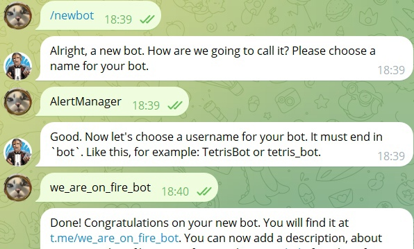
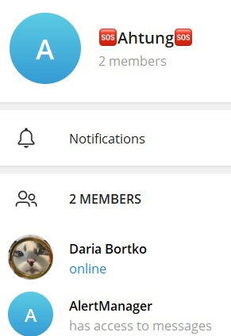
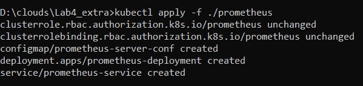
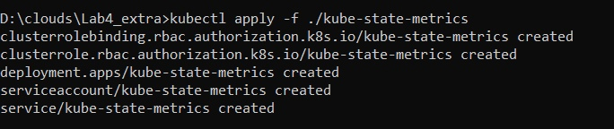
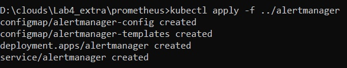
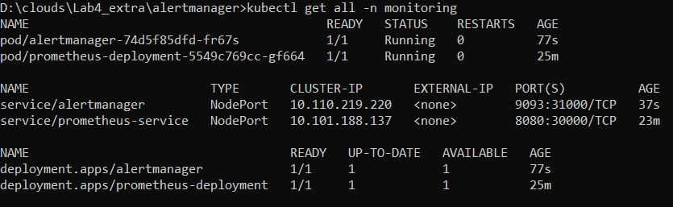
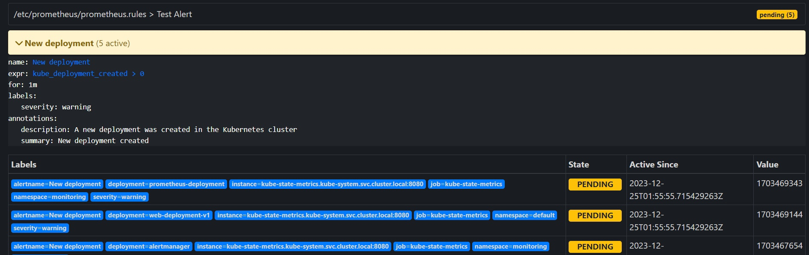
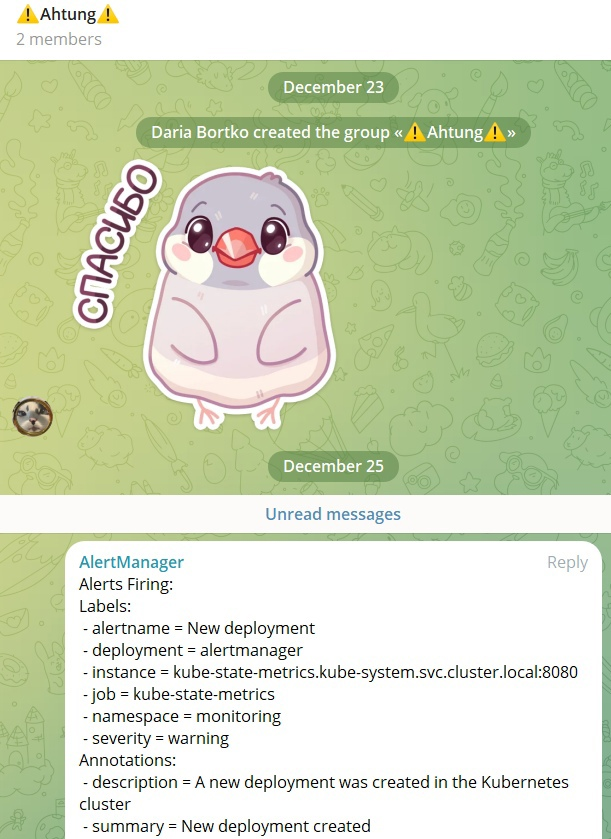

# Отчет по четвертой лабораторной работе (со звездочкой)
## 1. Что нужно сделать

1. Настроить алерт кодом

## 2. Создание телеграм-бота

Процесс довольно быстрый и простой - используем @BotFather, следуем инструкциям, получаем своего бота и токен к нему:

Добавляем бота в отдельную группу и сохраняем id чата, он еще пригодится

## 3. Prometheus-KSM-Alertmanager

В первой части практической работы 4 Prometheus устанавливался через helm, сейчас, для удобства настройки, ставим его лапками через манифесты (./manifests/prometheus)

Для того, чтобы Prometheus мог собирать метрики с кластера, запускаем также через манифесты kube-state-metrics:

 

Осталось добавить Alertmanager, чтобы у нас получилась готовая инфраструктура для мониторинга и отправки уведомлений. Именно в конфигах Alertmanager'a нам пригодятся полученные на первом шаге токен и ID чата:

Проверяем, что все нужные поды крутятся:

Как видно на скрине, все работает, можем проверять доступность сервисов. Для Prometheus настроено правило на создание новых деплоев, так что список алертов выглядит следующим образом:

И в телеграм приходит следующее сообщение:

Что значит, что мы успешно справились с настройкой алертов кодом

